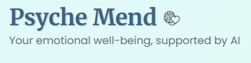
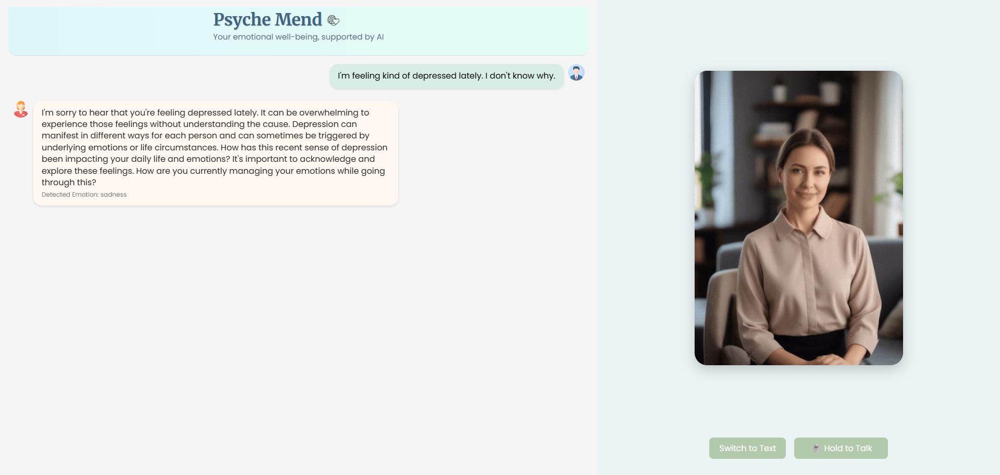
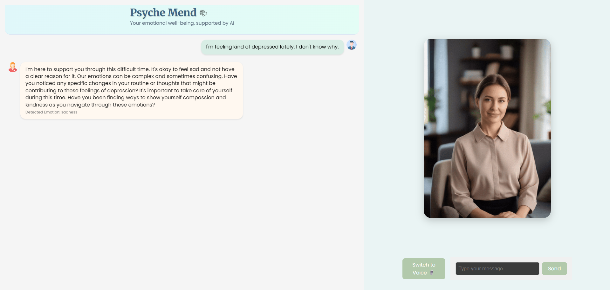

# Psyche Mend: AI Voice & Text Therapist

**Psyche Mend** is an AI-powered virtual therapist that supports emotional well-being through natural conversations. Users can interact using voice or text, and receive thoughtful, emotionally-aware responses with voice playback.

---

## ✨ Features

* ✨ Voice and Text input support
* 😊 Emotion-aware conversations using NLP
* 🎧 Whisper-based speech recognition
* 🎙️ Realistic TTS voice responses (Coqui TTS)
* 🧠 Sentiment detection via Hugging Face Transformers
* 🤝 GPT-3.5 for AI-powered empathetic replies
* ✨ Clean React UI with animation, avatars, and speech mode switching
* 🧑‍⚕️ **AI Therapist Avatar**: Feels like talking to a real person with facial animation

---

## 🛠 Development Environment

This project was developed using **Visual Studio Code (VS Code)**. VS Code is recommended for working with the codebase due to its Python and React ecosystem support, integrated terminal, and debugger.

The frontend is built using Vite + React, enabling fast development, hot module replacement (HMR), and optimized builds.

To enable smooth development:

* A `.vscode/settings.json` file is included to automatically detect the correct Python interpreter
* Virtual environment: `psyche-mend-env`
* Node/NPM used for frontend management

---

## 📚 Therapist Avatar Experience

An AI avatar is displayed on the right side of the interface to simulate a human-like presence. Its purpose is to help the user feel emotionally connected, as if speaking with a real therapist.

* When the AI is **idle or listening**, the avatar shows a calm therapist gently blinking.
* When the AI is **responding**, the avatar switches to one that moves its lips to simulate speaking.

Both animations are AI-generated using **Sora**, and contribute to the emotional realism of the conversation.

---

## 🌐 Branding

The project features a clean header with a logo and brand name:

### Logo & Brand Section



This reinforces the application's identity and professional appearance.

---

## 💡 Technologies Used

### Backend:

* **FastAPI** — API server
* **Whisper (openai-whisper)** — Speech-to-text
* **Transformers + DistilRoBERTa** — Sentiment detection
* **OpenAI GPT-3.5 Turbo** — Response generation
* **TTS (Coqui)** — Text-to-speech
* **pydub** + **ffmpeg** — Audio processing
* **dotenv** — Secure environment config

### Frontend:

* **React** + **Vite** — Fast frontend tooling
* **Custom components**: Recorder, ChatBubble, TypingDots, TextInput
* **CSS animations** — Typing effect, speaking state, fade transitions

---

## ⚡️ GPU Acceleration (Recommended)

This project can leverage GPU acceleration for faster and more efficient AI model inference.

**Why use a GPU instead of a CPU?**

* GPU is optimized for parallel operations (like matrix multiplications in neural networks)
* Significantly improves response times when using Whisper, Transformers, and TTS models
* Reduces lag, especially during live speech-to-text and TTS operations

If a compatible GPU is available (e.g., NVIDIA RTX), and you've installed the CUDA-enabled version of PyTorch,
Whisper and Coqui TTS will automatically use it via `torch.cuda.is_available()`.

To verify GPU usage, run:

```python
import torch
print(torch.cuda.is_available())
```

Note: The CUDA-enabled torch and torchaudio packages are commented out in requirements.txt for compatibility across systems.
To enable GPU support, install them manually using:

```bash
pip install torch==2.5.1+cu118 torchaudio==2.5.1+cu118 --index-url https://download.pytorch.org/whl/cu118
```

---

## 🚀 Getting Started

### 1. Clone the Repository

```bash
git clone https://github.com/JinsJK/psyche-mend.git
cd psyche-mend
```

### 2. Install Dependencies (Backend)

(Optional) Create and activate a virtual environment for isolation:

```bash
python -m venv psyche-mend-env
# On Windows:
.\psyche-mend-env\Scripts\Activate.ps1
# On macOS/Linux:
# source psyche-mend-env/bin/activate
```

Then install Python dependencies:

```bash
pip install -r requirements.txt
```

### 3. Setup Environment Variables

Create a `.env` file in the root with the following content:

```env
OPENAI_API_KEY=your-openai-api-key
```

Or copy and rename `.env.example`.

### 4. Install ffmpeg (Required)

#### 💼 Windows:

* Download from [https://ffmpeg.org/download.html](https://ffmpeg.org/download.html)
* Add `ffmpeg/bin` to your **System PATH**

#### 🌐 macOS:

```bash
brew install ffmpeg
```

#### 👷🏼 Linux:

```bash
sudo apt update
sudo apt install ffmpeg
```

Verify installation:

```bash
ffmpeg -version
```

### 5. Start Backend

If `main.py` is in the root folder:

```bash
uvicorn main:app --reload
```

(Use `backend.main:app` if it's under a `backend/` directory)

### 6. Start Frontend

```bash
cd frontend
npm install
npm run dev
```

Alternatively, on Unix-based systems with Make installed:

```bash
make dev
```

---

## 🔹 How It Works

1. **User Speaks or Types**: Press and hold the mic button or use the text box
2. **Speech to Text**: Whisper transcribes audio
3. **Emotion Detection**: Hugging Face model analyzes the tone
4. **AI Response**: GPT-3.5 generates an empathetic reply
5. **TTS Voice Reply**: Coqui synthesizes the response into audio
6. **Chat UI**: Emotion + voice + bubble feedback rendered
7. **Avatar Animation**: Therapist avatar moves while speaking

---

## 📷 Screenshots

### Conversing via Voice



### Text Mode Interface



---

## 📁 Folder Structure

```
psyche-mend/
├── backend/
│   ├── __init__.py
│   ├── response_gen.py
│   ├── sentiment.py
│   ├── speech_to_text.py
│   └── text_to_speech.py
├── frontend/
│   ├── public/
│   ├── node_modules/
│   ├── src/
│   │   ├── assets/
│   │   ├── components/
│   │   │   ├── ChatBubble.css
│   │   │   ├── ChatBubble.jsx
│   │   │   ├── Recorder.css
│   │   │   ├── Recorder.jsx
│   │   │   ├── TextInput.css
│   │   │   ├── TextInput.jsx
│   │   │   ├── TypingDots.css
│   │   │   └── TypingDots.jsx
│   │   ├── App.css
│   │   ├── App.jsx
│   │   ├── index.css
│   │   └── main.jsx
├── audio/
├── audio_samples/
├── .vscode/
├── psyche-mend-env/
├── .env
├── .env.example
├── .gitignore
├── LICENSE
├── Makefile
├── main.py
├── requirements.txt
└── README.md
```

---

## 🚧 Warnings / Notes

* This app is not a replacement for licensed therapists.
* Be mindful of OpenAI usage limits and pricing.
* A GPU is strongly recommended for optimal performance.

---

## 🙏 Credits

* [Coqui TTS](https://github.com/coqui-ai/TTS)
* [OpenAI Whisper](https://github.com/openai/whisper)
* [Hugging Face Transformers](https://huggingface.co)
* [Sora (AI Avatar Generator)](https://www.sora.app/)

---

## 🙋 Author

Created and maintained by **Jins Joseph Kakkanattu**
[GitHub: @JinsJK](https://github.com/JinsJK) — [jins7152@gmail.com](mailto:jins7152@gmail.com)

---

## 🧾 License

This project is licensed under the [MIT License](./LICENSE) © 2025 Jins Joseph Kakkanattu.
